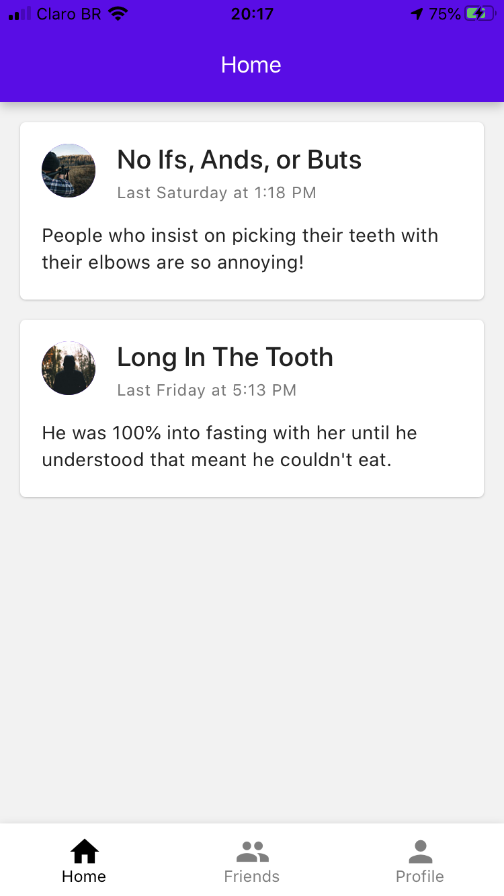
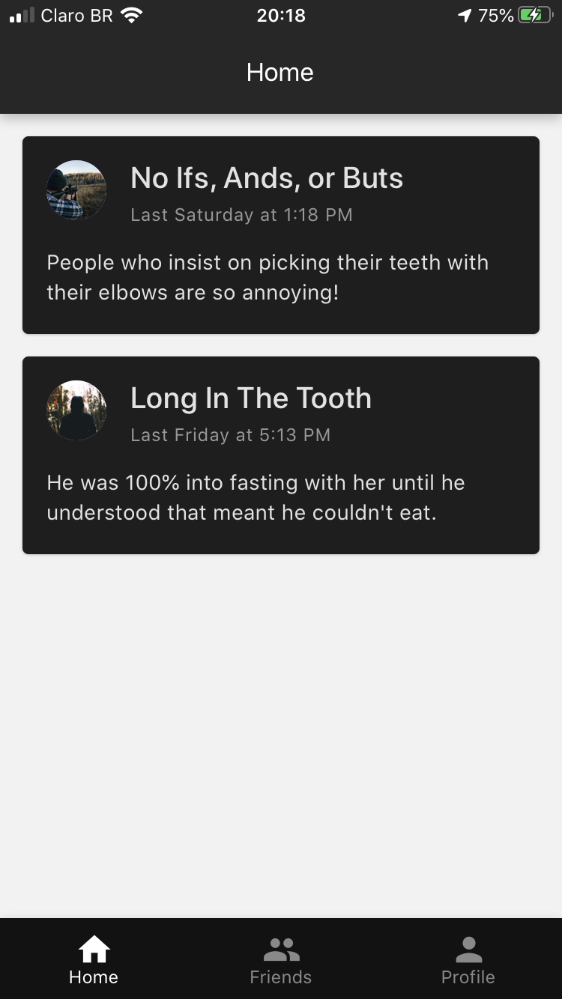
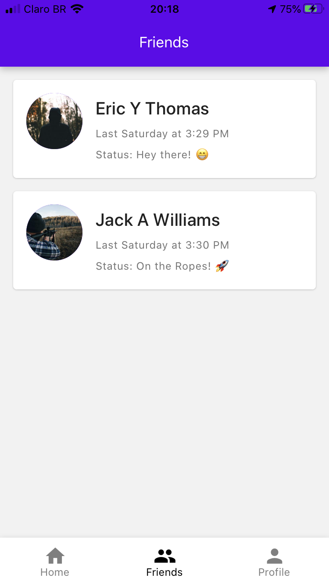
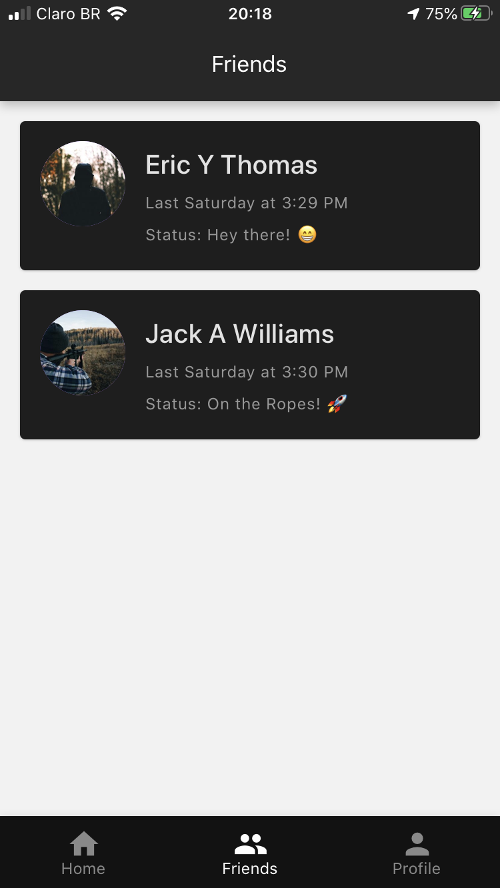
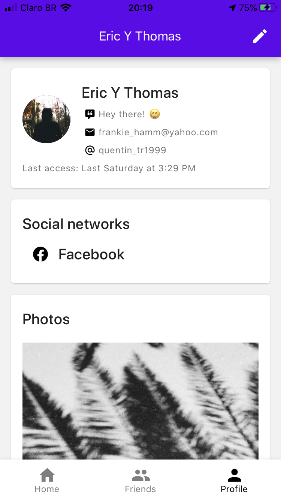
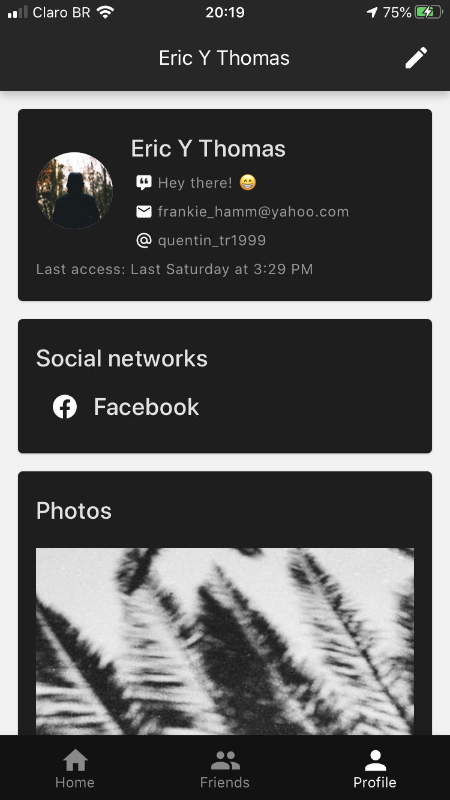

# react-native-social-network

## Sobre

Esta aplicação consiste em uma rede social fictícia, todos os dados apresentados aqui são fakes e estáticos (read-only). Este projeto foi desenvolvido em React Native, com auxílio de bibliotecas como react-redux, react-navigation, react-native-paper e entre outros. A aplicação contém uma listagem de pequenos posts, usuários, chat entre esses usuários além de recursos gráficos como skeleton placeholder e dark mode.

## Abordagens

Para essa aplicação foi-se adotado as boas práticas no desenvolvimento de aplicações ES6. O fluxo de dados é simples, a aplicação faz uma consulta na api em seu primeiro acesso e armazena no Store dados como: posts, perfis e conversas, para que assim não seja necessário uma segunda consulta ao acessar páginas como Amigos.
